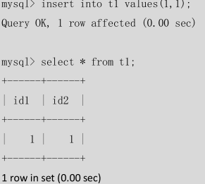
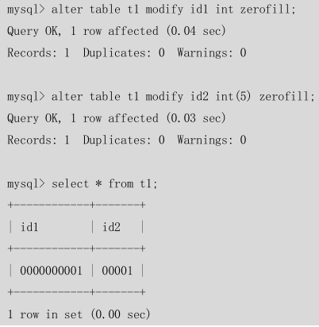

== 命令的结束符，用;或者\g 结束== 

## SQL分类

- DDL（Data Definition Languages）语句

  > 数据**定义**语言，这些语句定义了不同的数据段、 数据库、表、列、索引等数据库对象的定义。常用的语句关键字主要包括 create、drop、alter 等。

- DML  (Data Manipulation Language）语句

  > 数据**操纵**语句，用于添加、删除、更新和查 询数据库记录，并检查数据完整性，常用的语句关键字主要包括 ==insert、delete、update 和 select==  等

- DCL（Data Control Language）语句

  > 数据**控制**语句，用于控制不同数据段直接的许可和 访问级别的语句。这些语句定义了数据库、表、字段、用户的访问权限和安全级别。主要的 语句关键字包括 grant、revoke 等。

` DDL 和 DML 语言的最大区别是 DML 只是对表内部数据的操作，而不涉及到表的定 义、结构的修改，更不会涉及到其他对象。` 

## Mysql基本操作

### DDL

#### 1.创建数据库

```mysql
mysql> create database test1; 
Query OK, 1 row affected (0.00 sec)
```

- Query OK : 表示执行成功

- 1 row affected : 此操作只影响数据库一行记录

- (0.00 sce ) : 执行此操作所用时间

如果已经存在这个数据库，系统会提示：

```mysql
 mysql> create database test1; 
 ERROR 1007 (HY000): Can't create database 'test1'; database exists
```

##### 查询已经存在数据库

```mysql
mysql> show databases;
+--------------------+ 
| Database|
+--------------------+ | information_schema |
| cluster 
| mysql 
| test 
| test1
+--------------------+ 
5 rows in set (0.00 sec)
```

**安装 MySQL 时系统自动创建的库**

```mysql
 'information_schema'：主要存储了系统中的一些数据库对象信息。比如用户表信息、列信 息、权限信息、字符集信息、分区信息等。 
 'cluster'：存储了系统的集群信息。 
 'mysql'：存储了系统的用户权限信息。 
 'test'：系统自动创建的测试数据库，任何用户都可以使用。
```

##### 切换/选择 数据库

```mysql
use dbname
```

然后再用以下命令来查看 test1 数据库中创建的所有数据表： 

```mysql
mysql> use test1 
Database changed
mysql> show tables; 
Empty set (0.00 sec)
```

#### 2．删除数据库

`drop database dbname;`

要删除 test1数据库可以使用以下语句：

```mysql
mysql> drop database test1;
Query OK, 0 rows affected (0.00 sec)
```

> 可以发现，提示操作成功后，后面却显示了“0 rows affected”，这个提示可以不用管它，在 MySQL 里面，drop 语句操作的结果显示都是“0 rows affected”。

#### 3．创建表

```mysql
CREATE TABLE tablename (
column_name_1 column_type_1constraints， 
column_name_2 column_type_2 constraints，
……column_name_n column_type_n constraints
）
```

**column_name 是列的名字，column_type 是列的数据类型，contraints 是这个列的约 束条件**

##### 查看表的定义:

1. 表创建完毕后，如果需要查看一下表的定义

可以使用如下命令：

```mysql
 DESC tablename
```

```mysql
mysql> create table emp(ename varchar(10),hiredate date,sal decimal(10,2),deptno int(2)); 
Query OK, 0 rows affected (0.02 sec)
```


2. 虽然 desc 命令可以查看表定义，但是其输出的信息还是不够全面，为了查看更全面的表定 义信息，有时就需要通过查看创建表的 SQL 语句来得到，可以使用如下命令实现

```mysql
mysql> show create table emp \G; 
*************************** 1. row *************************** 
Table: emp
Create Table: CREATE TABLE `emp` (
    `ename` varchar(20) DEFAULT NULL, 
    `hiredate` date DEFAULT NULL, 
    `sal` decimal(10,2) DEFAULT NULL, 
    `deptno` int(2) DEFAULT NULL,
    KEY `idx_emp_ename` (`ename`)
) ENGINE=InnoDB DEFAULT CHARSET=gbk 
1 row in set (0.02 sec)
ERROR: 
No query specified
mysql>
```

从上面表的创建 SQL 语句中，除了可以看到表定义以外，还可以看到表的 **engine**（存储引擎） 和 **charset**（字符集）等信息。***“\G”***选项的含义是使得记录能够按照字段竖着排列，对于内 容比较长的记录更易于显示。

#### 4．删除表

表的删除命令如下： 

DROP TABLE tablename

例如，要删除数据库 emp 可以使用以下命令：

```mysql
mysql> drop table emp;
```


#### 5．修改表

##### （1） 修改表类型，语法如下：

```mysql
ALTER TABLE tablename MODIFY [COLUMN] column_definition [FIRST | AFTER col_name]
```

如:修改表 emp 的 ename 字段定义，将 varchar(10)改为 varchar(20)：

```mysql
mysql> alter table emp modify ename varchar(20);
```

##### 2） 增加表字段，语法如下

```mysql
ALTER TABLE tablename ADD [COLUMN] column_definition [FIRST | AFTER col_name]
```

例如，表 emp上新增加字段 age，类型为 int(3)：

```mysql
mysql> alter table emp add column age int(3);
```

##### （3）删除表字段，语法如下：

`ALTER TABLE tablename DROP [COLUMN] col_name` 

例如，将字段 age 删除掉：

```mysql
mysql> alter table emp drop column age;
```

##### （4）字段改名，语法如下：

```mysql
ALTER TABLE tablename CHANGE [COLUMN] old_col_name column_definition [FIRST|AFTER col_name]
```

例如，将 age 改名为 age1，同时修改字段类型为 int(4)

```mysql
mysql> alter table emp change age age1 int(4) ;
```

> 注意：**change 和modify**都可以修改表的定义，不同的是 change 后面需要写两次列名，不方便。 但是 change 的***优点***是可以修改列名称，modify则不能。

##### （5）修改字段排列顺序

> 前面介绍的的字段增加和修改语法**（ADD/CNAHGE/MODIFY）**中，都有一个可选项 **first|after column_name**，这个选项可以用来修改字段在表中的位置，默认 ADD 增加的新字段是加在 表的最后位置，而 CHANGE/MODIFY 默认都不会改变字段的位置。

例如，将新增的字段 birth date 加在 ename 之后：

```mysql
mysql> alter table emp add birth date after ename;
```

修改字段 age，将它放在最前面：

```mysql
alter table emp modify age int(3) first;
```

> 注意：CHANGE/FIRST|AFTER COLUMN这些关键字都属于MySQL在标准 SQL上的扩展，在 其他数据库上不一定适用

##### （6）表改名，语法如下：

`ALTER TABLE tablename RENAME [TO] new_tablename`

如，将表 emp 改名为 emp1，命令如下：

```mysql
alter table emp rename emp1;
```

### DML

> DML 操作是指对数据库中表记录的操作，主要包括表记录的插入（insert）、更新（update）、删除（delete）和查询（select），是开发人员日常使用最频繁的操作。下面将依次对它们进 行介绍。

#### 1．插入记录

表创建好后，就可以往里插入记录了，插入记录的基本语法如下：

```mysql
INSERT INTO tablename (field1,field2,……fieldn) VALUES(value1,value2,……valuesn);
```

例如，向表 emp 中插入以下记录：ename 为 zzx1，hiredate 为 2000-01-01，sal 为 2000，deptno 为 1，命令执行如下：

```mysql
mysql> insert into emp (ename,hiredate,sal,deptno) values('zzx1','2000-01-01','2000',1);
```

也可以不用指定字段名称，但是 values 后面的顺序应该和字段的排列顺序一致：

```mysql
mysql> insert into emp
values('lisa','2003-02-01','3000',2);
```

> 对于含可空字段、非空但是含有默认值的字段、自增字段，可以不用在 insert 后的字段列表 里面出现，values 后面只写对应字段名称的 value，这些没写的字段可以自动设置为 NULL、 默认值、自增的下一个数字，这样在某些情况下可以大大缩短 SQL 语句的复杂性

例如，只对表中的 ename 和 sal 字段显式插入值：

```mysql
mysql> insert into emp (ename,sal) values('dony',1000);
```


在MySQL 中，insert 语句还有一个很好的特性，可以一次性插入多条记录，语法如下:

```mysql
INSERT INTO tablename 
(field1, field2,……fieldn) 
VALUES 
(record1_value1, record1_value2,……record1_valuesn), 
(record2_value1, record2_value2,……record2_valuesn), 
…… 
(recordn_value1, recordn_value2,……recordn_valuesn) ;

```

下面的例子中，对表 dept 一次插入两条记录： 

```mysql
mysql> insert into dept values(5,'dept5'),(6,'dept6');
```

#### 2．更新记录

1. 对于表里的记录值，可以通过 update 命令进行更改，语法如下：

```mysql
UPDATE tablename SET field1=value1，field2.=value2，……fieldn=valuen [WHERE CONDITION]
```

例如，将表 emp 中 ename 为“lisa”的薪水（sal）从 3000 更改为 4000：

```mysql
 mysql> update emp set sal=4000 where ename='lisa';
```

2. 在MySQL 中，update 命令可以同时更新多个表中数据，语法如下：

```mysql
 UPDATE t1,t2…tn set t1.field1=expr1,tn.fieldn=exprn [WHERE CONDITION]
```

在下例中，**同时更新**表 emp 中的字段 sal 和表 dept 中的字段 deptname：

```mysql
mysql> update emp a,dept b set a.sal=a.sal*b.deptno,b.deptname=a.ename where
a.deptno=b.deptno;
```

> 注意：多表更新的语法更多地用在了根据一个表的字段，来动态的更新另外一个表的字段

#### 3．删除记录

1. 如果<u>记录不再需要，可以用 delete 命令进行删除</u>，语法如下

```mysql
DELETE FROM tablename [WHERE CONDITION]
```

例如，在 emp中将 ename 为‘dony’的记录全部删除，命令如下：

```mysql
 mysql> delete from emp where ename='dony';
```

2. 在MySQL 中可以一次删除多个表的数据，语法如下：

```mysql
 DELETE t1,t2…tn FROM t1,t2…tn [WHERE CONDITION]
```

> 如果 from后面的表名用**别名**，则 delete 后面的也要用相应的别名，否则会提示语法错误

在下例中，将表 emp和 dept 中 deptno 为 3 的记录同时都删除：

```mysql
mysql> delete a,b from emp a,dept b where a.deptno=b.deptno and a.deptno=3;
```

> ==注意==：不管是单表还是多表，不加where条件将会把表的所有记录删除，所以操作时一定要小心。

#### 4．查询记录

```mysql
SELECT * FROM tablename [WHERE CONDITION]
```

最简单的方式是将记录全部选出:` select * from emp;`

>  “*”的好处是当需要查询所有字段信息时候，查询语句很简单，但是要只查询部分字段的 时候，必须要将字段一个一个列出来

##### （1）查询不重复的记录

有时需要将表中的记录去掉重复后显示出来，可以用distinct 关键字来实现：

```mysql
mysql> select distinct deptno from emp;
select distinct [字段] from [表]
```

##### （2）条件查询。

```mysql
select * from emp where deptno=1;
```

##### （3）排序和限制。

我们经常会有这样的需求，取出按照某个字段进行排序后的记录结果集，这就用到了数据库 的排序操作，用关键字 ORDER BY 来实现，语法如下：

```mysql
SELECT * FROM tablename [WHERE CONDITION] [ORDER BY field1 [DESC|ASC]，field2 [DESC|ASC]，……fieldn [DESC|ASC]]
```

##### DESC 和 ASC 

>DESC 和 ASC 是排序顺序关键字，DESC 表示按照字段进行降序排列，ASC 则表示升序 排列，如果不写此关键字**默认**是升序排列。

>ORDER BY 后面可以跟**多个**不同的排序字段，并 且每个排序字段可以有不同的排序顺序。

如果排序字段的值一样，则值相同的字段**按照第二个排序字段进行排序**，以此类推。如果只 有一个排序字段，则这些字段相同的记录将会无序排列。

```mysql
mysql> select * from emp order by deptno,sal desc;
```

先deptno降序,若deptno值相等,则按sal降序


- 对于排序后的记录，如果希望只显示一部分，而不是全部，这时，就可以使用 ==**LIMIT**== 关键字 来实现，LIMIT 的语法如下：

  ```mysql
  SELECT ……[LIMIT offset_start,row_count]
  ```

  > 其中 offset_start 表示记录的起始偏移量，row_count 表示显示的行数。 在默认情况下，起始偏移量为 0，只需要写记录行数就可以，这时候，显示的实际就是前 n 条记录，看下面例子：

  例如，显示 emp 表中按照 sal 排序后的前 3 条记录： 

  ```mysql
  mysql> select * from emp order by sal limit 3;
  ```

  如果要显示 emp 表中按照 sal 排序后从第二条记录开始，显示 3 条记录：

  ```mysql
  mysql> select * from emp order by sal limit 1,3;
  ```

  ***limit 经常和 order by 一起配合使用来进行记录的分页显示。***

`注意：limit 属于MySQL扩展 SQL92 后的语法，在其他数据库上并不能通用。`

##### （4）聚合。

聚合操作的语法如下:

```mysql
SELECT [field1,field2,……fieldn] fun_name 
FROM tablename 
[WHERE where_contition] 
[GROUP BY field1,field2,……fieldn 
 [WITH ROLLUP]] 
 [HAVING where_contition]
```

对其参数进行以下说明。

  fun_name 表示要做的聚合操作，也就是聚合函数，常用的有 sum（求和）、count(*)（记 录数）、max（最大值）、min（最小值）。

  GROUP BY 关键字表示要进行分类聚合的字段，比如要按照部门分类统计员工数量，部门 就应该写在 group by 后面。 

 WITH ROLLUP 是可选语法，表明是否对分类聚合后的结果进行再汇总。

  HAVING 关键字表示对分类后的结果再进行条件的过滤。

```python
注意：having 和 where 的区别在于 'having 是对聚合后'的结果进行条件的过滤，而 'where 是在聚合前'就对记录进行过滤，如果逻辑允许，我们尽可能用where先过滤记录，这样因为结果 集减小，将对聚合的效率大大提高，最后再根据逻辑看是否用having进行再过滤。
```

要 emp表中统计公司的总人数：

```mysql
 mysql> select count(1) from emp;
```

在此基础上，要统计各个部门的人数： 

```mysql
mysql> select deptno,count(1) from emp group by deptno;
```

更细一些，既要统计各部门人数，又要统计总人数：

```mysql
 mysql> select deptno,count(1) from emp group by deptno with rollup;
```

统计人数大于 1 人的部门： 

```mysql
mysql> select deptno,count(1) from emp group by deptno having count(1)>1;
```

后统计公司所有员工的薪水总额、最高和最低薪水：

```mysql
ysql> select sum(sal),max(sal),min(sal) from emp;
```

##### （5）表连接。

当需要同时显示多个表中的字段时，就可以用表连接来实现这样的功能。 从大类上分，表连接分为内连接和外连接，它们之间的最主要区别是內连接仅选出两张表中 互相匹配的记录，而外连接会选出其他不匹配的记录。我们最常用的是内连接

**内连接** :

```mysql
mysql> select ename,deptname from emp,dept where emp.deptno=dept.deptno;
```

**外连接** :

外连接有分为左连接和右连接，具体定义如下。

- **左连接**：包含所有的左边表中的记录甚至是右边表中没有和它匹配的记录 

- **右连接**：包含所有的右边表中的记录甚至是左边表中没有和它匹配的记录

```mysql
mysql> select ename,deptname from emp left join dept on emp.deptno=dept.deptno

or

mysql> select ename,deptname from dept right join emp on dept.deptno=emp.deptno;
```

如上:左连接是以连接时,左边的表为主表,显示左表的所有匹配字段,即使连接的表中无匹配字段.如下图:

右连接,反之.


##### （6）子查询

某些情况下，当我们查询的时候，需要的条件是另外一个 select 语句的结果，这个时候，就 要用到子查询。用于子查询的关键字主要包括 in、not in、=、!=、exists、not exists 等。

例如，从 emp表中查询出所有部门在 dept 表中的所有记录：

```mysql
mysql> select * from emp where deptno in(select deptno from dept);
```

如果子查询记录数唯一，还可以用=代替 in：

```mysql
mysql> select * from emp where deptno = (select deptno from dept); 
ERROR 1242 (21000): Subquery returns more than 1 row 
mysql> select * from emp where deptno = (select deptno from dept limit 1);

#转换为表连接后(内连接)：
mysql> select emp.* from emp ,dept where emp.deptno=dept.deptno;
```

> 注意：子查询和表连接之间的转换主要应用在两个方面： 
>
>  MySQL 4.1 以前的版本不支持子查询，需要用表连接来实现子查询的功能
>
>   表连接在很多情况下用于优化子查询

##### （7）记录联合。

将两个表的数据按照一定的查询条件查询出来后，将**结果合并** 到一起显示出来，这个时候，就需要用 union 和 union all 关键字来实现这样的功能，具体语 法如下：

```mysql
SELECT * FROM t1 
UNION|UNION ALL 
SELECT * FROM t2 …… 
UNION|UNION ALL 
SELECT * FROM tn;

```

UNION和 UNION ALL 的主要区别是 

**UNION ALL** 是把结果集直接合并在一起;

 **UNION**是将 UNION ALL 后的结果进行一次 DISTINCT，**去除重复**记录后的结果。

### DCL 

#### DCL 语句

DCL 语句主要是 DBA 用来管理系统中的**对象权限**时所使用，一般的开发人员很少使用。下面 通过一个例子来简单说明一下。

创建一个数据库用户 z1，具有对 sakila 数据库中所有表的 SELECT/INSERT 权限：

```mysql
mysql> grant select,insert on sakila.* to 'z1'@'localhost' identified by '123';
mysql> exit Bye
[mysql@db3 ~]$ mysql -uz1 -p123 
Welcome to the MySQL monitor.
Commands end with ; or \g.
```

由于权限变更，需要将 z1 的权限变更，收回 INSERT，只能对数据进行 SELECT 操作：

```mysql
mysql>revoke insert on sakila.* from 'z1'@'localhost';
```

用户 z1 重新登录后执行前面语句：

```mysql
mysql> insert into emp values('bzshen','2005-04-01',3000,'3'); 
ERROR 1142 (42000): INSERT command denied to user 'z1'@'localhost' for table 'emp'

```

以上例子中的 grant 和 revoke 分别授出和收回了用户 z1 的部分权限

## MySQL 支持的数据类型

#### 数值类型

Mysql 数据类型

| 整数类型              | 字节 | 最小值                                                       | 最大值          |
| --------------------- | ---- | ------------------------------------------------------------ | --------------- |
| tinyint               | 1    | -128(有符号)/0                                               | 127/255         |
| smallint              | 2    | -32768/0                                                     | 32767/65535     |
| mediumint             | 3    | -8388608/0                                                   | 8388607/1677215 |
| int\ integer          | 4    |                                                              |                 |
| bigint                | 8    |                                                              |                 |
| **浮点类型**          | 字节 | 最小值                                                       | 最大值          |
| float                 | 4    | +- 1.17E-38                                                  | +- 3.4E+38      |
| double                | 8    | +- 2.25E-308                                                 | +- 1.79E+308    |
| 定点数类型            | 字节 |                                                              |                 |
| dec(M,D)/decimal(M,D) | M+2  | 最大取值范围与DOUBLE相同，给定DECIMAL的有效取值范围由M和D 决定 |                 |
| 位类型                | 字节 | 最小值                                                       | 最大值          |
| BIT(M)                | 1~8  | BIT(1)                                                       | BIT(64)         |

(1)创建表 t1，有 id1 和 id2两个字段，指定其数值宽度分别为 int 和 int(5)。

```mysql
mysql> create table t1 (id1 int,id2 int(5));
```


(2)在 id1 和 id2 中都插入数值 1，可以发现格式没有异常。



（3）分别修改 id1和 id2 的字段类型，加入 zerofill 参数



在数值前面用字符“0”**填充了剩余的宽度**。

大家可能会有所疑问，设置了宽度 限制后,如果插入大于宽度限制的值，会不会截断或者插不进去报错？

答案是肯定的：==不会== 对插入的数据有任何影响，还是按照类型的实际精度进行保存，这是，宽度格式实际已经没 有意义，左边不会再填充任何的“0”字符。

##### AUTO_INCREMENT

可按下列 任何一种方式定义 AUTO_INCREMENT 列：

```MYSQL
CREATE TABLE AI (ID INT AUTO_INCREMENT NOT NULL PRIMARY KEY);
CREATE TABLE AI (ID INT AUTO_INCREMENT NOT NULL , PRIMARY KEY(ID) );
CREATE TABLE AI (ID INT AUTO_INCREMENT NOT NULL, UNIQUE(ID));
```

##### 浮点数和定点数(decimal)

对于小数的表示，MySQL 分为两种方式：浮点数和定点数。

浮点数包括 `float`（单精度）和 `double`（双精度），

而**定点数**则只有 `decimal` 一种表示。定点数在MySQL 内部以字符串形 式存放，比浮点数更精确，适合用来表示货币等精度高的数据

> 浮点数和定点数都可以用类型名称后加“(M,D)”的方式来进行表示，“(M,D)”表示该
> 值一共显示M位数字（整数位+小数位），其中 D 位位于小数点后面，M和 D 又称为精度和 标度。

而 decimal 在不指定精度时，默认的整数位为 10，默认的小数位为 0

**（1）创建测试表**，分别将 id1、id2、id3 字段设置为 float(5,2)、double(5,2)、decimal(5,2)。

```MYSQL
CREATE TABLE `t1` ( `id1` float(5,2) default NULL, `id2` double(5,2) default NULL, `id3` decimal(5,2) default NULL
)
mysql> insert into t1 values(1.23,1.23,1.23);

+------+------+------+ | 
id1| id2 | id3 |
+------+------+------+ 
| 1.23 | 1.23 | 1.23 | 
+------+------+------+

mysql> insert into t1 values(1.234,1.234,1.234); 
Query OK, 1 row affected, 1 warning (0.00 sec)
mysql> show warnings;    #查看warning信息

+-------+------+------------------------------------------+ 
| Level | Code | Message|
+-------+------+------------------------------------------+ 
| Note| 1265 | Data truncated for column 'id3' at row 1 |
+-------+------+------------------------------------------+
```

##### BIT　

对于 BIT（位）类型，用于存放位字段值，BIT(M)可以用来存放多位**二进制**数，M范围从 1～ 64，如果不写则默认为 1 位。对于位字段，直接使用 SELECT 命令将不会看到结果，可以用 bin()（显示为二进制格式）或者 hex()（显示为十六进制格式）函数进行读取

```mysql
mysql> select bin(id),hex(id) from t2;
```

