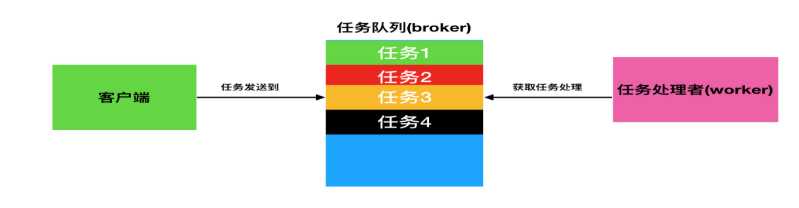

## Python-Django

#### 1.代码优化从哪些方面考虑？有什么想法？

1. 优化算法时间
2. 循环优化
3. 并行编程

> 因为 GIL 的存在，Python 很难充分利用多核 CPU 的优势。但是，可以通过内置的模块multiprocessing 实现下面几种并行模式:
>
> 1. 多进程
> 2. 多线程
> 3. 分布式
>
> > multiprocessing 中的 Managers 类提供了可以在不同进程之共享数据的方式，可以在此 基础上开发出分布式的程序。

4. 使用性能分析工具

   > 除了上面在 ipython 使用到的 timeit 模块，还有 cProfile。cProfile 的使用方式也非常简单：
   > python-mcProfilefilename.py，filename.py 是要运行程序的文件名，可以在标准输出中看到每一个 函数被调用的次数和运行的时间，从而找到程序的性能瓶颈，然后可以有针对性地优化

5. set用法

> set 的 union，intersection，difference 操作要比 list 的迭代要快。因此如果涉及到求 list 交 集，并集或者差的问题可以转换为 set 来操作

6. PyPy

> PyPy 是用 RPython(CPython 的子集)实现的 Python，根据官网的基准测试数据，它比 CPython
> 实现的 Python 要**快 6 倍**以上。

> 快的原因是使用了 Just-in-Time(JIT)编译器，即**动态编译器**，与静态 编译器(如 gcc，javac 等)不同，它是利用程序运行的过程的数据进行优化。由于历史原因，目前 pypy 中还保留着 GIL，不过正在进行的 STM 项目试图将 PyPy 变成没有 GIL 的 Python。如果 python 程序中含有 C 扩展(非 cffi 的方式)，JIT 的优化效果会大打折扣，甚至比 CPython 慢（比 Numpy）。 所以在 PyPy 中最好用纯 Python 或使用 cffi 扩展。

#### 2.Django 中间件

中间件不用继承自任何类（可以继承 object）

process_response，process_view， process_exception 和 process_template_response

1. 初始化

2. process_request(self, request):

   > 处理请求前：在每个请求上，request 对象产生之后，url 匹配之前调用，返回 None 或
   > HttpResponse 对象。

3. process_view(self， request， view_func， *view_args，**view_kwargs):

   > 处理视图前：在每个请求上，url 匹配之后，视图函数调用之前调用，返回 None 或
   > HttpResponse 对象。

4. process_response(self, request, response)

   > 处理响应后：视图函数调用之后，所有响应返回浏览器之前被调用，在每个请求上调用，返回 HttpResponse 对象。

5. process_exception(self， request，exception):

   > 异常处理：当视图抛出异常时调用，在每个请求上调用，返回一个HttpResponse 对象。

#### 3.有用过 Django REST framework 吗？

Django REST framework 是一个强大而灵活的 Web API 工具。使用 RESTframework 的理由
有：

- Web browsable API 对开发者有极大的好处 

- 包括 OAuth1a 和 OAuth2 的认证策略 
- 支持 ORM 和非 ORM 数据资源的序列化
-  全程自定义开发——如果不想使用更加强大的功能，可仅仅使用常规的 function-based views 额外的文档和强大的社区支持

#### 4.Celery分布式任务队列

> 情景：用户发起 request，并等待 response 返回。在本些 views 中，可能需要执行一段**耗时的程 序**，那么用户就会等待**很长**时间，造成不好的用户体验，比如发送邮件、手机验证码等。

**使用 celery 后，情况就不一样了。解决：将耗时的程序放到 celery 中执行。**

将多个耗时的任务添加到队列 queue 中，也就是用 redis 实现 broker 中间人，然后用多个worker 去监听队列
里的任务去执行。



- 任务 task：就是一个 Python 函数。 
- 队列 queue：将需要执行的任务加入到队列中。 
-  工人worker：在一个新进程中，负责执行队列中的任务。 
-  代理人 broker：负责调度，在布置环境中使用 redis。

#### 5.Jieba 分词 

Jieba 分词支持三种分词模式：

- 精确模式：试图将句子最精确地切开，适合文本分析；

  ```mysql
  jieba.cut("他来到上海交通大学", cut_all=False)
  ```

  

- 全模式：把句子中所有的可以成词的词语都扫描出来， 速度非常快，但是不能解决歧义； 

  ```mysql
  jieba.lcut("他来到上海交通大学", cut_all=True)
  ```

  

- 搜索引擎模式：在精确模式的基础上，对长词再次切分，提高召回率，适合用于搜索引擎分词

  ```mysql
  jieba.cut_for_search("他来到上海交通大学")
  ```
  
  

功能： 

​		分词，添加自定义词典，关键词提取，词性标注，并行分词，

**Tokenize**：返回词语在原文的起始位 置，**ChineseAnalyzer** **for** **Whoosh** 搜索引擎。

[jieba简明教程]( https://www.jianshu.com/p/883c2171cdb5 )


#### 6.简述浏览器是如何获取一枚网页的

```markdown
1.在用户输入目的 URL 后，浏览器先向 DNS 服务器发起域名解析请求； 
2.在获取了对应的 IP 后向服务器发送请求数据包;(http)
3.服务器接收到请求数据后查询服务器上对应的页面，并将找到的页面代码回复给客户端； 
4.客户端接收到页面源代码后，检查页面代码中引用的其他资源，并再次向服务器请求该资源； 
5.在资源接收完成后，客户端浏览器按照页面代码将页面渲染输出显示在显示器上；
```

#### 7.cookie 与 session 的了解？他们能单独用吗

> Session 采用的是在服务器端保持状态的方案，而 Cookie 采用的是在客户端保持状态的方案。但
> 是**禁用 Cookie 就不能得到 Session**。因为 Session 是用 Session ID 来确定当前对话所对应的服务 器 Session，而 ==Session ID 是通过 Cookie 来传递的==，禁用 Cookie 相当于失去了 SessionID，也 就得不到 Session。

#### 8.Django 对数据查询结果排序怎么做，降序怎么做，查询大于某个字段怎么做

- 排序使用 order_by() 
- 降序需要在排序字段名前加
-  查询字段大于某个值：使用 filter(字段名_gt=值)

#### 9.关系型数据库的关系包括哪些类型？

- ForeignKey：一对多，将字段定义在多的一端中。
- ManyToManyField：多对对：将字段定义在两端中。 
- OneToOneField：一对一，将字段定义在任意一端中

#### 10.查询集返回列表的过滤器有哪些？

- all() ：返回所有的数据 
- filter()：返回满足条件的数据 
-  exclude()：返回满足条件之外的数据，相当于 sql 语句中where 部分的 not 关键字 
-  order_by()：排序

#### 11.判断查询集正是否有数据？

**exists()：**判断查询集中否有数据，如果有则返回 True，没有则返回 False。

#### 12.apache 和 nginx 的区别？

##### **Nginx 相对Apache 的优点：**

- 轻量级，同样起 web 服务，比 apache 占用更少的内存及资源； 
- 抗并发，nginx 处理请求是异步非阻塞的，支持更多的并发连接，而 apache 则是阻塞型的，在高并发下 nginx 能保持低资源低消耗高性能； 
- 配置简洁；
- 高度模块化的设计，编写模块相对简单； 社区活跃。

##### Apache 相对Nginx 的优点：

-  rewrite ，比 nginx 的 rewrite 强大； 
- 模块超多，基本想到的都可以找到；
-  少 bug ，nginx 的 bug 相对较多；
-  超稳定。

#### 13.varchar 与 char 的区别？

> char 长度是固定的，不管你存储的数据是多少他都会都固定的长度。而 varchar 则处可变长度但他 要在总长度上加 1 字符，这个用来存储位置。所以在处理速度上 char 要比 varchar 快速很多，但是对 费存储空间，所以对存储不大，但在速度上有要求的可以使用 char 类型，反之可以用 varchar 类型。


## MySQL

#### 1.SQL Select 语句完整的执行顺序：

> 1、from子句组装来自不同数据源的数据； 
>
> 2、where 子句基于指定的条件对记录行进行筛选；
>
>  3、group by 子句将数据划分为多个分组；
>
>  4、使用聚集函数进行计算； 
>
> 5、使用 having 子句筛选分组； 
>
> 6、计算所有的表达式；
>
>  7、select 的字段；
>
>  8、使用 order by 对结果集进行排序。

SQL语言不同于其他编程语言的最明显特征是处理代码的顺序。在大多数据库语言中，代码按 编码顺序被处理。但在 SQL 语句中，第一个被处理的子句式 FROM，而不是第一出现的 SELECT。 

#### 2.SQL 查询处理的步骤序号：

> (1) FROM <left_table> 
>
> (2) <join_type> JOIN <right_table> 
>
> (3) ON <join_condition>
>
>  (4) WHERE <where_condition>
>
>  (5) GROUP BY <group_by_list>
>
>  (6) WITH {CUBE | ROLLUP} (7) HAVING <having_condition>
>
>  (8) SELECT (9) DISTINCT
>
>  (9) ORDER BY <order_by_list>
>
>  (10) <TOP_specification> <select_list>

以上每个步骤都会产生一个**虚拟表**，该虚拟表被用作下一个步骤的输入。这些虚拟表对调用
者(客户端应用程序或者外部查询)**不可用**。**只有最后一步生成的表才会会给调用者**。如果没有在 查询中指定某一个子句，将跳过相应的步骤。

#### 3.逻辑查询处理阶段简介：

> 1、 FROM：对 FROM子句中的前两个表执行笛卡尔积(交叉联接)，生成虚拟表VT1。 
>
> 2、 ON：对VT1 应用ON筛选器，只有那些使为真才被插入到 TV2。
>
>  3、 OUTER (JOIN):如果指定了OUTER JOIN(相对于CROSS JOIN或 INNER JOIN)，保留 表中未找到匹配的行将作为外部行添加到VT2，生成TV3。如果FROM子句包含两个以上的表， 则对上一个联接生成的结果表和下一个表重复执行步骤 1 到步骤3，直到处理完所有的表位置。 
>
> 4、 WHERE：对 TV3 应用WHERE 筛选器，只有使为 true 的行才插入 TV4。
>
>  5、 GROUP BY：按GROUP BY 子句中的列列表对 TV4 中的行进行分组，生成 TV5。 
>
> 6、 CUTE|ROLLUP：把超组插入VT5，生成 VT6。
>
>  7、 HAVING：对 VT6 应用HAVING筛选器，只有使为 true 的组插入到 VT7。
>
>  8、 SELECT：处理 SELECT 列表，产生VT8。
>
>  9、 DISTINCT：将重复的行从 VT8 中删除，产品 VT9。 
>
> 10、 ORDER BY：将VT9中的行按ORDER BY子句中的列列表顺序，生成一个游标(VC10)。 
>
> 11、 TOP：从 VC10 的开始处选择指定数量或比例的行，生成表 TV11，并返回给调用者。

#### 4.说一下Mysql 数据库存储的原理

储存过程是一个可编程的函数，它在数据库中创建并保存。它可以有 SQL语句和一些特殊的控制结
构组成。当希望在不同的应用程序或平台上执行相同的函数，或者封装特定功能时，存储过程是非常有用的。数据库中的存储过程可以看做是对编程中面向对象方法的模拟。它允许控制数据的访问方式。存 储过程通常有以下优点：

>  1、存储过程能实现较快的执行速度
>
>  2、存储过程允许标准组件是编程。
>
>  3、存储过程可以用流程控制语句编写，有很强的灵活性，可以完成复杂的判断和较复杂的运算。
>
>  4、存储过程可被作为一种安全机制来充分利用。 
>
> 5、存储过程能够减少网络流量

#### 5.数据库怎么优化查询效率

> 1、储存引擎选择：如果数据表需要事务处理，应该考虑使用 InnoDB，因为它完全符合ACID特性。 如果不需要事务处理，使用默认存储引擎MyISAM是比较明智的 
>
> 2、分表分库，主从。 
>
> 3、对查询进行优化，要尽量避免全表扫描，首先应考虑在 where 及 order by 涉及的列上建立索
> 引 
>
> 4、应尽量避免在 where 子句中对字段进行 null 值判断，否则将导致引擎放弃使用索引而进行全
> 表扫描 
>
> 5、应尽量避免在 where 子句中使用 != 或 <> 操作符，否则将引擎放弃使用索引而进行全表扫
> 描
>
> 6、应尽量避免在 where 子句中使用 or 来连接条件，如果一个字段有索引，一个字段没有索引， 将导致引擎放弃使用索引而进行全表扫描 
>
> 7、Update 语句，如果只更改 1、2 个字段，不要Update 全部字段，否则频繁调用会引起明显的 性能消耗，同时带来大量日志 
>
> 8、对于多张大数据量（这里几百条就算大了）的表 JOIN，要先分页再 JOIN，否则逻辑读会很高，
> 性能很差。

#### 6.数据库的优化？

```markdown
1. 优化索引、SQL 语句、分析慢查询； 
2.设计表的时候严格根据数据库的**设计范式**来设计数据库； 
3. 使用缓存，把经常访问到的数据而且不需要经常变化的数据放在缓存中，能节约磁盘 IO 
4.优化硬件；采用 SSD，使用磁盘队列技术(RAID0,RAID1,RDID5)等 
5. 采用MySQL 内部自带的表分区技术，把数据分层不同的文件，能够提高磁盘的读取效率； 
6.垂直分表；把一些不经常读的数据放在一张表里，节约磁盘 I/O； 
7. 主从分离读写；采用主从复制把数据库的读操作和写入操作分离开来； 
8.分库分表分机器（数据量特别大），主要的的原理就是数据路由； 
9. 选择合适的表引擎，参数上的优化 
10.进行架构级别的缓存，静态化和分布式； 
11. 不采用全文索引； 
12.采用更快的存储方式，例如 NoSQL 存储经常访问的数据**。
```

#### 7.Mysql 数据库如何分区、分表？

分表可以通过三种方式：Mysql 集群、自定义规则和merge 存储引擎。

 分区有四类：

> RANGE 分区：基于属于一个给定连续区间的列值，把多行分配给分区。
>
>  LIST 分区：类似于按 RANGE 分区，区别在于 LIST 分区是基于列值匹配一个离散值集合中的某个 值来进行选择。 
>
> HASH 分区：基于用户定义的表达式的返回值来进行选择的分区，该表达式使用将要插入到表中的 这些行的列值进行计算。这个函数可以包含MySQL 中有效的、产生非负整数值的任何表达式。
>
>  KEY 分区：类似于按HASH 分区，区别在于 KEY 分区只支持计算一列或多列，且MySQL 服务器 提供其自身的哈希函数。必须有一列或多列包含整数值。

#### 8.Mysql 数据库中怎么实现分页？

```mysql
select * from table limit (start-1)*limit,limit;
其中 start 是页码，limit 是每页显示的条数。
```

#### 9.提取数据库中倒数 10 条数据？

**mysql:**

```mysql
select  * from table1 order by id desc limit 10;
```

**sqlserver:**

```mysql
select top (10) * from table1 order by id desc。
```

 **oracle:**

```sql
sselect * from table_name where rownum < 10 
```


#### 10.Mysql 数据库的操作?

修改表-修改字段，重命名版： 

```mysql
alter table 表名 change 原名 新名 类型及约束； 
alter table students change birthday birth datetime not null; 
```

修改表-修改字段，不重名版本：

```mysql
 alter table 表名 modify 列名 类型和约束；
 alter table students modify birth date not null
```


 全列插入：

```mysql
insert into 表名 values(...) 
insert into students values(0,"郭靖", 1,"内蒙","2017-6"); 
```


部分插入：值的顺序与给出的列顺序对应： 

```mysql
insert into students(name, birthday) values("黄蓉","2017-8"); 

```

修改：update 表名 set 列 1=值 1，列 2=值 2.。。where 

```mysql
update students set gender=0, homwtown="古墓"， where id = 5; 
```

备份

```shell
mysqldump -uroot -p 数据库名 '>' python.sql, 
```

恢复：

> **mysql -uroot -p 数据库名 ==<== python.sql**

#### 11.数据库的设计？

**第一范式**：数据库表的每一列都是不可分割的原子数据项，即列不可拆分。

**第二范式**：建立在第一范式的基础上，要求数据库表中的每个实例或记录必须是可以唯一被区分的， 即唯一标识。

**第三范式**：建立在第二范式的基础上，任何非主属性不依赖与其他非主属性，即引用主键。

#### 12.存储过程和函数的区别?

**相同点**：存储过程和函数都是为了可重复的执行操作数据库的 sql 语句的集合。

> 1）存储过程和函数都是一次编译，就会被缓存起来，下次使用就直接命中已经编译好的 sql 语句， 不需要重复使用。减少网络交互，减少网络访问流量。

**不同点**：标识符不同，函数的标识符是 function，存储过程是 proceduce。

> 1）函数中有返回值，且必须有返回值，而过程没有返回值，但是可以通过设置参数类型（in,out) 来实现多个参数或者返回值。
>
>  2）存储函数使用 select 调用，存储过程需要使用 call 调用。
>
>  3）select 语句可以在存储过程中调用，但是除了 select..into 之外的 select 语句都不能在函数中使
> 用。
>
> 4）通过 in out 参数，过程相关函数更加灵活，可以返回多个结果。

#### 13.Mysql 日志

**错误日志**：记录启动，运行或者停止mysql 时出现的问题； 

**通用日志**：记录建立的客户端连接和执行的语句；

 **二进制日志**：记录所有更改数据的语句；

 **慢查询日志**：记录所有执行时间超过 long_query_time 秒的查询或者不适用索引的查询）通过使用--slow_query_log[={0|1}]选项来启用慢查询日志，所有执行时间超多 long_query_time 的语 句都会被记录。

## MongoDB

#### 1.数据库的一些基本操作命令（列举一些常用命令即可）

##### MySQL 的常见命令如下：

```mysql
1. create database name; 创建数据库
2. use databasename; 选择数据库 
3. drop database name 直接删除数据库，不提醒 
4. show tables; 显示表
5. describe tablename; 表的详细描述 
6. select 中加上 distinct 去除重复字段
7. mysqladmin drop databasename 删除数据库前，有提示。 
8. 显示当前mysql 版本和当前日期
9. select version(),current_date;
```

##### MongoDB 的常见命令如下：

```mariadb
1. db.help(); Help 查看命令提示 
2. use yourDB; 切换/创建数据库 
3. show dbs; 查询所有数据库 
4. db.dropDatabase(); 删除当前使用数据库 
5. db.getName(); 查看当前使用的数据库 
6. db.version(); 当前 db 版本
7. db.addUser("name"); 添加用户 
8. db.addUser("userName", "pwd123", true); 
9. show users; 显示当前所有用户
10. db.removeUser("userName"); 删除用户 
11.db.yourColl.count(); 查询当前集合的数据条数
```

#### 2.Python 中调用mongo 数据库的包叫什么？

**==Pymongo==** 

#### 3.MongoDB成为优秀的NoSQL 数据库的原因是什么

以下特点使得MongoDB 成为优秀的NoSQL 数据库：

> 1）面向文件的 
>
> 2）高性能 
>
> 3）高可用性 
>
> 4）易扩展性 
>
> 5）丰富的查询语言

#### 4.分析器在MongoDB 中的作用是什么?

MongoDB 中包括了一个可以显示数据库中每个操作性能特点的**数据库分析器。**通过这个分析器 你可以找到比预期慢的查询(或写操作);利用这一信息，可以确定是否需要**添加索引**

#### 5.怎么查看MongoDB 正在使用的链接? 

```mariadb
db._adminCommand("connPoolStats");
```

